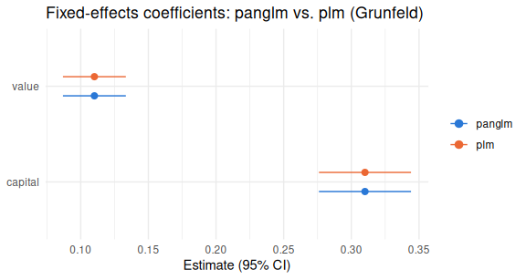

# panglm

<!-- badges: start -->

[](https://github.com/ielbadisy/panglm/actions/workflows/R-CMD-check.yaml)
[](https://opensource.org/licenses/MIT)
[](https://lifecycle.r-lib.org/articles/stages.html#experimental)
<!-- badges: end -->

Fast generalized linear models for panel data: pooled, fixed-effects
("within"), and random-effects estimators for gaussian, poisson,
binomial, and negative binomial outcomes, backed by an
Rcpp/RcppArmadillo/RcppParallel numerical core. Every estimator here is
validated against an external reference implementation (`plm`, `pglm`,
`fixest`, `MASS::glm.nb`, `survival::clogit`, `pscl::hurdle`, or
`glmmTMB`), not just checked for "it runs" -- see the Validation section
below and `vignette("panglm-methods")`.

## Installation

``` r
# install.packages("remotes")
remotes::install_github("ielbadisy/panglm")
```

## Fixed effects, exactly matching `plm`

``` r
library(panglm)
data(Grunfeld, package = "plm")

f_panglm <- panglm(inv ~ value + capital, data = Grunfeld,
                    index = c("firm", "year"), model = "within", family = "gaussian")
f_plm    <- plm::plm(inv ~ value + capital, data = Grunfeld,
                      index = c("firm", "year"), model = "within")

summary(f_panglm)
#> 
#> Call:
#> panglm(formula = inv ~ value + capital, data = Grunfeld, index = c("firm", 
#>     "year"), model = "within", family = "gaussian")
#> 
#> Family: gaussian  Link: identity  Model: within  Effect: individual 
#> N = 200  groups = 10  vcov: classical 
#> 
#> Coefficients:
#>         Estimate Std. Error z value Pr(>|z|)    
#> value    0.11012    0.01186   9.288   <2e-16 ***
#> capital  0.31007    0.01735  17.867   <2e-16 ***
#> ---
#> Signif. codes:  0 '***' 0.001 '**' 0.01 '*' 0.05 '.' 0.1 ' ' 1
#> 
#> Dispersion parameter: 2784 
#> Residual df: 188  Iterations: 2
```

``` r
cbind(panglm = coef(f_panglm), plm = coef(f_plm), diff = coef(f_panglm) - coef(f_plm))
#>            panglm       plm          diff
#> value   0.1101238 0.1101238 -4.163336e-17
#> capital 0.3100653 0.3100653  4.996004e-16
```

``` r
est <- rbind(
  data.frame(term = names(coef(f_panglm)), estimate = coef(f_panglm),
             se = sqrt(diag(vcov(f_panglm))), fit = "panglm"),
  data.frame(term = names(coef(f_plm)), estimate = coef(f_plm),
             se = sqrt(diag(vcov(f_plm))), fit = "plm")
)
ggplot2::ggplot(est, ggplot2::aes(x = estimate, y = term, color = fit)) +
  ggplot2::geom_pointrange(
    ggplot2::aes(xmin = estimate - 1.96 * se, xmax = estimate + 1.96 * se),
    position = ggplot2::position_dodge(width = 0.4), fatten = 3
  ) +
  ggplot2::scale_color_manual(values = c(panglm = "#2a78d6", plm = "#eb6834")) +
  ggplot2::labs(title = "Fixed-effects coefficients: panglm vs. plm (Grunfeld)",
                x = "Estimate (95% CI)", y = NULL, color = NULL) +
  ggplot2::theme_minimal(base_size = 11)
#> Warning: The `fatten` argument of `geom_pointrange()` is deprecated as of ggplot2 4.0.0.
#> ℹ Please use the `size` aesthetic instead.
#> This warning is displayed once per session.
#> Call `lifecycle::last_lifecycle_warnings()` to see where this warning was generated.
```



The two estimates are indistinguishable, as they should be: `panglm`'s
`model = "within"` is an exact, closed-form demeaning estimator, not an
approximation of `plm`'s.

## Count panels: fixed-effects Poisson and negative binomial

``` r
set.seed(1)
Grunfeld$count <- rpois(nrow(Grunfeld), lambda = exp(0.5 + 0.0001 * Grunfeld$value))

f_pois <- panglm(count ~ value + capital, data = Grunfeld,
                  index = c("firm", "year"), model = "within", family = "poisson")
coef(f_pois)
#>         value       capital 
#> -2.805999e-05  2.672632e-04
```

``` r
u <- rep(rgamma(10, shape = 5, rate = 5), each = 20)
Grunfeld$count_nb <- rpois(nrow(Grunfeld), lambda = u * exp(1 + 0.0002 * Grunfeld$value))

f_nb <- panglm(count_nb ~ value + capital, data = Grunfeld,
               index = c("firm", "year"), model = "within", family = "negbin")
coef(f_nb)
#>        value      capital 
#> 0.0001173754 0.0001871722
fixest::fenegbin(count_nb ~ value + capital | firm, data = Grunfeld) |> coef()
#> Warning: [femlm]: The information matrix is singular: presence of collinearity.
#> Very high value of theta (10000). There is no sign of overdispersion, you may consider a Poisson
#> model.
#>        value      capital 
#> 0.0001173811 0.0001872010
```

`family = "negbin"` uses the Allison-Waterman (2002) unconditional
dummy-variable estimator and matches `fixest::fenegbin()` exactly,
including `effect = "twoways"` (individual + time fixed effects);
`family = "poisson"` uses the conditional (concentrated) MLE (Hausman,
Hall & Griliches 1984), matching
`pglm(model = "within", family = poisson)`.

## Structural zeros: a fixed-effects hurdle model

Ordinary Poisson/NB can't distinguish a *structural* zero (a group that
never has the event) from an *ordinary* sampling zero at low mean -- it
just shows up as extreme overdispersion regardless of family.
`panglm_hurdle()` decomposes the two:

``` r
set.seed(9)
N <- 60; Tt <- 8
d <- data.frame(id = rep(1:N, each = Tt), time = rep(1:Tt, N))
d$x1  <- rnorm(N * Tt)
a_i   <- rep(rnorm(N, sd = 1.5), each = Tt)
mu    <- exp(0.3 + 0.5 * d$x1 + a_i)
p0    <- plogis(1 - 1.2 * a_i)
zero  <- rbinom(N * Tt, 1, p0) == 1
d$y   <- ifelse(zero, 0, rpois(N * Tt, mu))

fit <- panglm_hurdle(y ~ x1, data = d, index = c("id", "time"))
#> 18 group(s) with no within-group outcome variation dropped (all-0 or all-1) -- they carry no information for the conditional likelihood.
fit
#> 
#> Fixed-effects hurdle model for panel count data
#> Zero part (1(y>0), conditional logit):
#>        x1 
#> 0.1394545 
#> 
#> Count part (zero-truncated Poisson, N = 186 positive obs of 480 ):
#>        x1 
#> 0.4847225
```

The count part (zero-truncated Poisson, fit only on `y > 0`) recovers
the true slope of `0.5`; the zero part is fit via the same exact
conditional logistic regression `panglm(..., family = "binomial")`
already uses.

## Standard errors: classical, HC1, or cluster-robust

``` r
sqrt(diag(vcov(f_panglm, type = "classical")))
#>      value    capital 
#> 0.01185669 0.01735450
sqrt(diag(vcov(f_panglm, type = "cluster")))
#>      value    capital 
#> 0.01515608 0.05261839
```

## What's estimated, and against what

| `model`   | `family`                  | Method                                                        | Validated against                                      |
|-----------|---------------------------|---------------------------------------------------------------|--------------------------------------------------------|
| `pooling` | gaussian/poisson/binomial | IRLS                                                          | `stats::glm()`                                         |
| `pooling` | negbin                    | theta-profiled IRLS                                           | `MASS::glm.nb()`                                       |
| `within`  | gaussian                  | exact demeaning (one-way or `twoways`)                        | `plm(model="within")`                                  |
| `within`  | poisson                   | conditional MLE (one-way or `twoways`)                        | `pglm()`, `fixest::feglm()`                            |
| `within`  | negbin                    | Allison-Waterman dummy-variable (one-way or `twoways`)        | `fixest::fenegbin()`                                   |
| `within`  | binomial                  | exact conditional logit (Chamberlain 1980)                    | `survival::clogit(method="exact")`                     |
| `random`  | gaussian                  | Swamy-Arora                                                   | `plm(model="random")`                                  |
| `random`  | poisson                   | Poisson-Gamma marginal                                        | `pglm(model="random")`                                 |
| `random`  | negbin                    | 2-parameter beta-negative-binomial marginal                   | `pglm()`'s `lnl.negbin.R`                              |
| `random`  | binomial                  | Gauss-Hermite quadrature                                      | `glmmTMB` (approximate, different mixing distribution) |
| --        | --                        | `panglm_hurdle()`: conditional logit + zero-truncated Poisson | `pscl::hurdle()`                                       |

Also included: `panglm_hausman()` (FE-vs-RE specification test),
`panglm_dispersiontest()` (Pearson chi-squared/df overdispersion test),
`confint.panglm()`, and `tidy()`/`glance()` methods for
`broom`/`modelsummary` pipelines.

Not yet covered: `effect = "twoways"` for binomial (no general
closed-form two-way conditional logit exists), between effects,
ordinal/tobit families, and a zero-truncated NB2 count part for
`panglm_hurdle()`. See `NEWS.md`.

## Validation

Every estimator above is checked against its reference implementation in
`tests/testthat/`, not just smoke-tested:

``` r
res <- testthat::test_local(reporter = testthat::SilentReporter$new())
#> 21 group(s) with no within-group outcome variation dropped (all-0 or all-1) -- they carry no information for the conditional likelihood.
#> 2 group(s) with all-zero outcomes dropped -- their fixed effect is unbounded under the dummy-variable NB2 MLE and carries no information about the shared slope.
df  <- as.data.frame(res)
c(pass = sum(df$passed), fail = sum(df$failed), warn = sum(df$warning), skip = sum(df$skipped))
#> pass fail warn skip 
#>   82    0    0    0
```

See `vignette("panglm-methods")` for the full walkthrough (33+
executable validation chunks) and `NEWS.md` for what changed and when.
